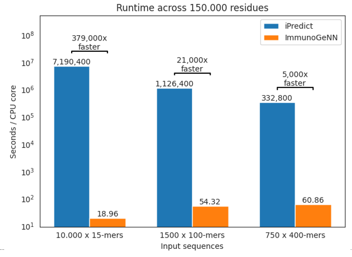

## ImmunoGeNN
ImmunoGeNN accepts input protein sequences and predicts peptide MHC-II immunogenicity risk scores based on MHC-II allele frequencies in the global population. It predicts risk scores at up to over 300.000 times the rate of NetMHCIIpan-4.3.

For more details please see the [pre-print](https://openreview.net/forum?id=kOJQm9YXnB) by Høie et al., "ImmunoGeNN: Accelerating Early Immunogenicity Assessment for Generative Design of Biologics", presented at the EurIPS 2025 Workshop on SIMBIOCHEM.

Example FASTA input:
```
>LYZL4_MOUSE Lysozyme-like protein 4
MQLYLVLLLISYLLTPIGASILGRCTVAKMLYDGGLNYFEGYSLENWVCLAYFESKFNPS
AVYEDPQDGSTGFGLFQIRDNEWCGHGKNLCSVSCTALLNPNLKDTIQCAKKIVKGKHGM
GAWPIWSKNCQLSDVLDRWLDGCDL
```

### Web-server
To run ImmunoGeNN without installing it you can try it on these web-servers:
- Web-server BioLib: https://biolib.com/DTU/ImmunoGeNN/
- Web-server DTU: https://services.healthtech.dtu.dk/services/ImmunoGeNN/

----

### Input format
- Input FASTA file of proteins sequences (minimum sequence length of 15 residues)
- Human reference - Toggle on to set peptide IRS scores to zero if (binding core) is observed in the human reference. Additional reference sequences may be added. Default on.

#### Human reference proteome filtering

Human reference filtering uses the top identified binding core and searches for matches in the human proteome.

### Output format

ImmunoGeNN predicts per-peptide IRS scores ("pIRS") for the North American population, DRB1 gene class. Sequence scores are calculated by summing across all peptides. 

Output files:
- pIRS.csv - CSV file containing per-peptide pIRS scores
- scores.csv - CSV file containing per-sequence pIRS scores (summed across all peptides)
- figures.html - Visualization of pIRS scores across sequences and peptides

----

### Download and run locally

Installation:
```
git clone https://github.com/novonordisk-research/ImmunoGeNN
cd ImmunoGeNN
unzip data_record.zip

pip install -r requirements.txt
```

Predicting protein immunogenicity risk scores:
```
python run.py --fasta_file \
    data/input.fasta
```

Deimmunizing first protein sequence:
```
python run.py \
    --fasta_file data/input.fasta \
    --deimmunize_first_sequence true
```

### Docker setup
Build Docker image:
```
docker build -t app-immunogenn .
```

Run Docker container:
```
docker run -v $(pwd)/data:/app/data -it app-immunogenn \
    python run.py --fasta_file data/input.fasta
```

---

### Speed benchmark



---

### Citation
```bib
@inproceedings{
    hoie2025_immunogenn,
    title={ImmunoGe{NN}: Accelerating Early Immunogenicity Assessment for Generative Design of Biologics},
    author={Magnus Haraldson H{\o}ie and Birkir Reynisson and Paolo Marcatili and Jesper Ferkinghoff-Borg and Kasper Lamberth and Katharina L. Kopp and Morten Nielsen and Vanessa Isabell Jurtz},
    booktitle={EurIPS 2025 Workshop on SIMBIOCHEM},
    year={2025},
    url={https://openreview.net/forum?id=kOJQm9YXnB}
}
```

### License
This project is licensed under the MIT License - see the LICENSE file for details.
